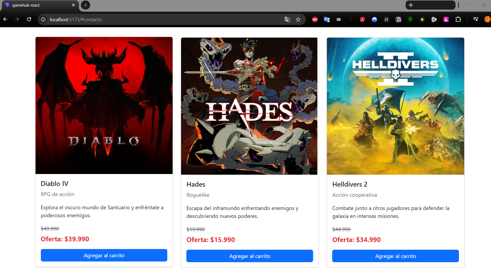
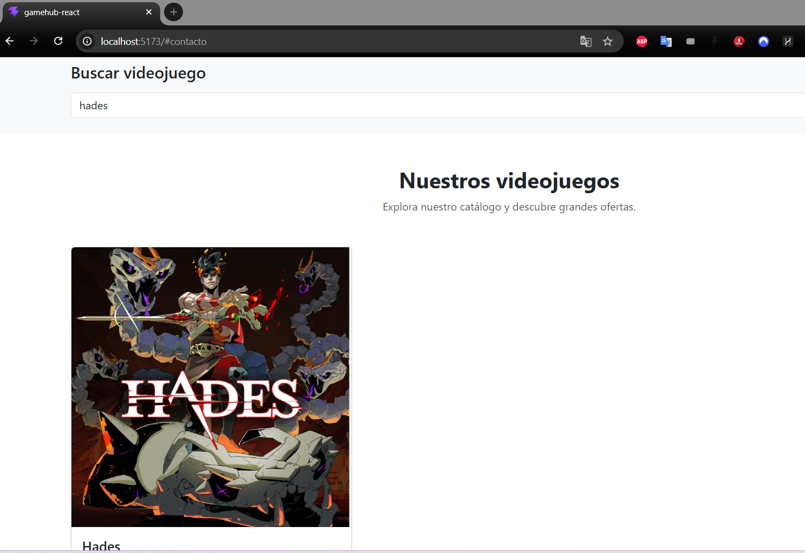
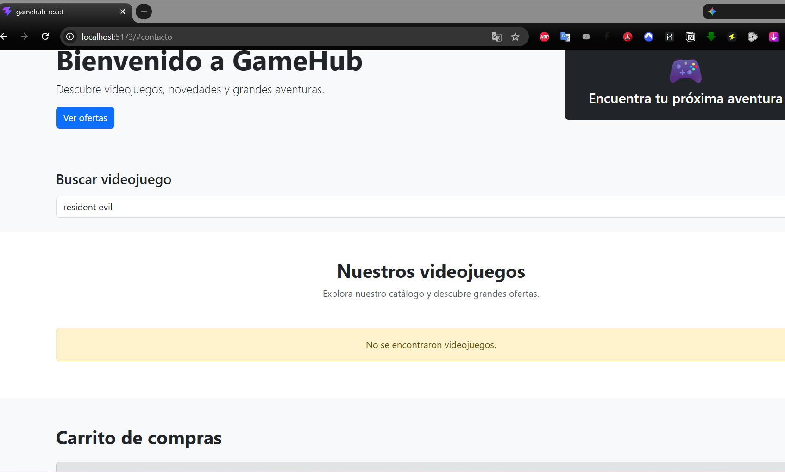
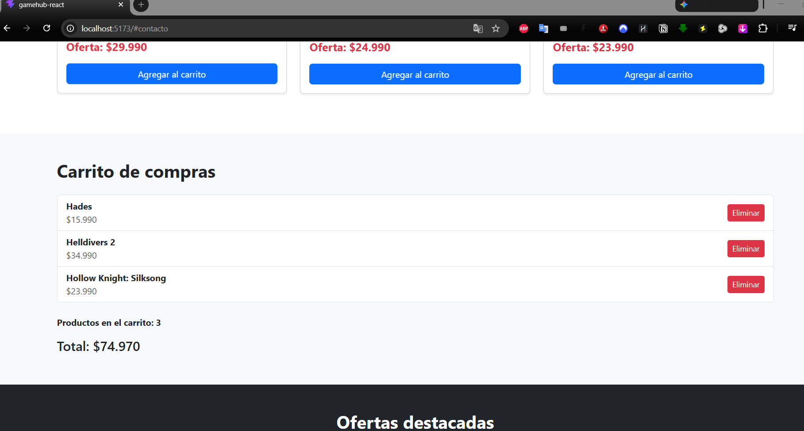
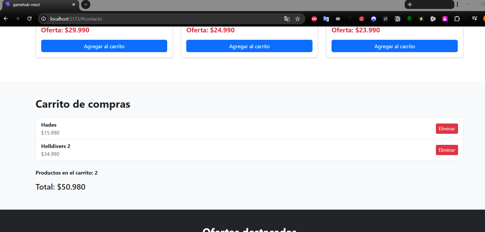
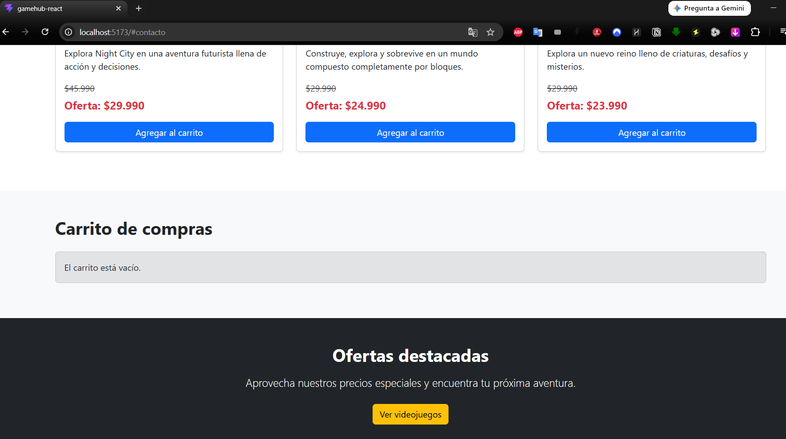
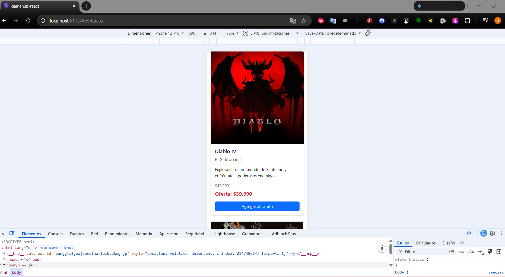
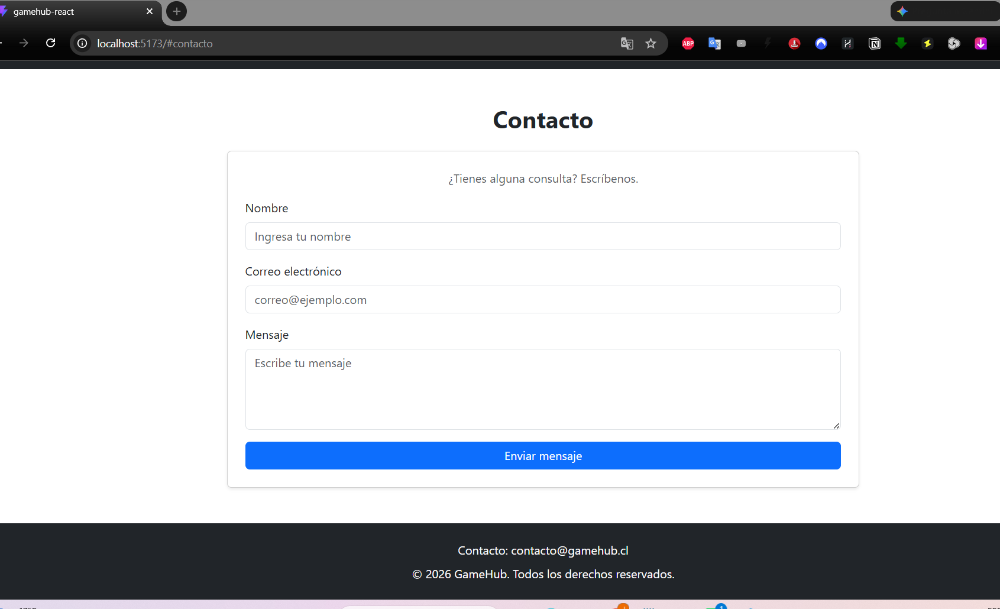

# GameHub - eCommerce de Videojuegos con React

## Descripción

GameHub es una aplicación web de eCommerce desarrollada con React que permite visualizar un catálogo de videojuegos, buscar productos y gestionar un carrito de compras.

El proyecto corresponde a la actividad formativa de la Semana 7 de la asignatura Desarrollo Frontend I (PFY2201).

La aplicación fue desarrollada a partir del proyecto realizado en semanas anteriores, migrando sus principales funcionalidades a componentes funcionales de React.

---

## Tecnologías utilizadas

- React
- Vite
- JavaScript
- JSX
- Bootstrap
- CSS
- HTML5
- Git y GitHub

---

## Funcionalidades

La aplicación incluye las siguientes funcionalidades:

- Visualización de un catálogo de videojuegos.
- Nombre del producto.
- Género.
- Descripción.
- Imagen.
- Precio normal.
- Precio de oferta.
- Búsqueda dinámica de videojuegos.
- Agregar productos al carrito.
- Eliminar productos del carrito.
- Contador de productos agregados.
- Cálculo automático del total del carrito.
- Mensaje cuando el carrito está vacío.
- Mensaje cuando una búsqueda no encuentra resultados.
- Diseño adaptable para dispositivos móviles.

---

## Componentes React

El proyecto está organizado mediante componentes funcionales reutilizables:

```text
src/
├── assets/
│   └── img/
├── components/
│   ├── Contact.jsx
│   ├── Footer.jsx
│   ├── Header.jsx
│   ├── Hero.jsx
│   ├── Offers.jsx
│   ├── ProductCard.jsx
│   ├── ProductList.jsx
│   ├── SearchBar.jsx
│   └── ShoppingCart.jsx
├── data/
│   └── juegos.js
├── App.jsx
├── index.css
└── main.jsx
```

Cada componente tiene una responsabilidad específica, permitiendo mantener el código organizado y reutilizable.

---

## Uso de Props

Las props permiten compartir información entre los diferentes componentes.

Por ejemplo, `ProductList` recibe el listado de videojuegos y envía cada videojuego al componente `ProductCard`.

También se utilizan props para compartir funciones como:

- `agregarAlCarrito`
- `eliminarDelCarrito`
- `setBusqueda`

---

## Uso de useState

La aplicación utiliza el Hook `useState` para manejar estados dinámicos.

Los principales estados utilizados son:

```javascript
const [carrito, setCarrito] = useState([]);
const [busqueda, setBusqueda] = useState("");
```

El estado `carrito` almacena los productos seleccionados por el usuario.

El estado `busqueda` almacena el texto ingresado en el buscador.

---

## Eventos

La aplicación utiliza eventos de React para generar interactividad.

### onClick

Se utiliza para agregar y eliminar productos del carrito.

```jsx
onClick={() => agregarAlCarrito(juego)}
```

### onChange

Se utiliza en el buscador para actualizar los resultados mientras el usuario escribe.

```jsx
onChange={(event) => setBusqueda(event.target.value)}
```

---

## Métodos de JavaScript utilizados

### map()

Permite recorrer el listado de videojuegos y generar dinámicamente las tarjetas de productos.

### filter()

Se utiliza para:

- Filtrar videojuegos mediante el buscador.
- Eliminar productos del carrito.

### reduce()

Permite calcular el precio total de todos los productos agregados al carrito.

---

## Renderizado condicional

React permite mostrar diferentes elementos dependiendo del estado de la aplicación.

Por ejemplo, cuando el carrito no contiene productos se muestra:

```text
El carrito está vacío.
```

Cuando una búsqueda no encuentra coincidencias se muestra:

```text
No se encontraron videojuegos.
```

---

## Instalación y ejecución

Para ejecutar el proyecto de forma local:

### 1. Instalar las dependencias

```bash
npm install
```

### 2. Ejecutar el servidor de desarrollo

```bash
npm run dev
```

La aplicación se ejecutará normalmente en:

```text
http://localhost:5173/
```

---

# Evidencias

## Catálogo de videojuegos

El catálogo muestra la imagen, nombre, descripción, precio normal y precio de oferta de cada videojuego.



---

## Búsqueda dinámica

El buscador permite filtrar los videojuegos mientras el usuario escribe.



---

## Búsqueda sin resultados

La aplicación utiliza renderizado condicional para informar cuando no existen coincidencias.



---

## Carrito de compras

El carrito permite agregar productos y muestra la cantidad total y el precio acumulado.



---

## Eliminación de productos

Cada producto agregado puede ser eliminado individualmente del carrito.



---

## Carrito vacío

Cuando no existen productos agregados, la aplicación muestra un mensaje mediante renderizado condicional.



---

## Diseño responsive

La interfaz se adapta a pantallas de menor tamaño.



---

## Contacto

La aplicación incluye una sección de contacto integrada con el diseño general de GameHub.



---

## Repositorio

El código fuente del proyecto se encuentra disponible en GitHub:

https://github.com/Johanromanque/Desarrollo_Frontend_I

La aplicación se encuentra desplegada mediante GitHub Pages:

https://johanromanque.github.io/Desarrollo_Frontend_I/7%20Actividad%20Formativa/

---

## Autor

**Johan Romanque**

Desarrollo Frontend I - PFY2201  
Duoc UC
