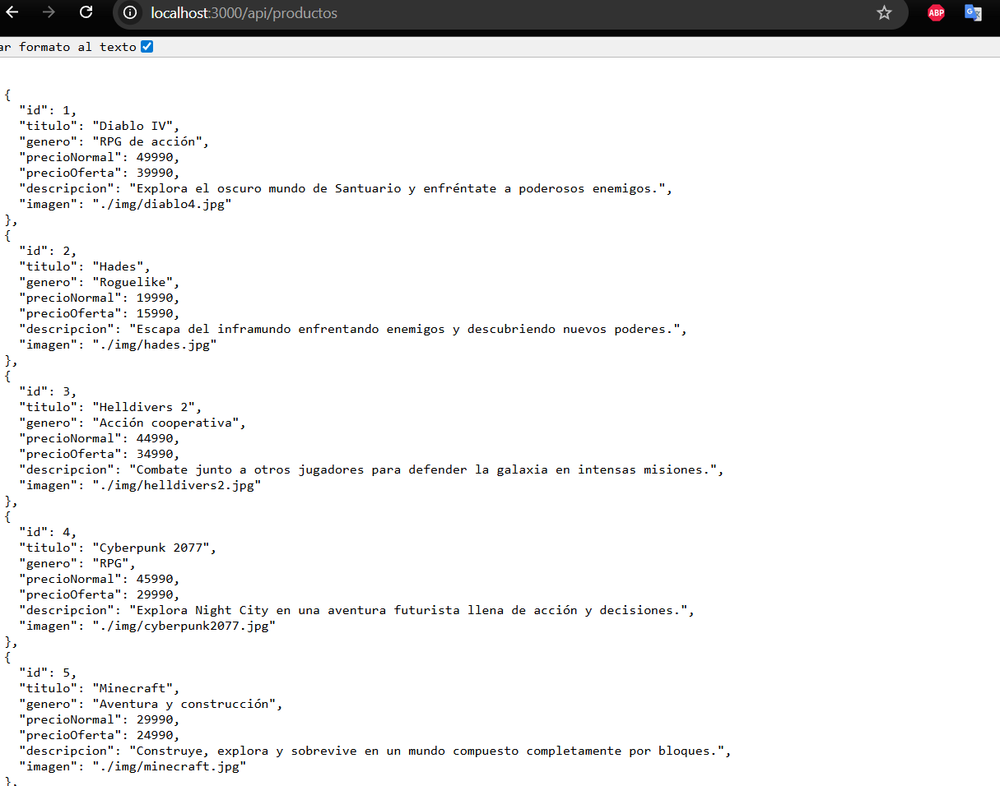
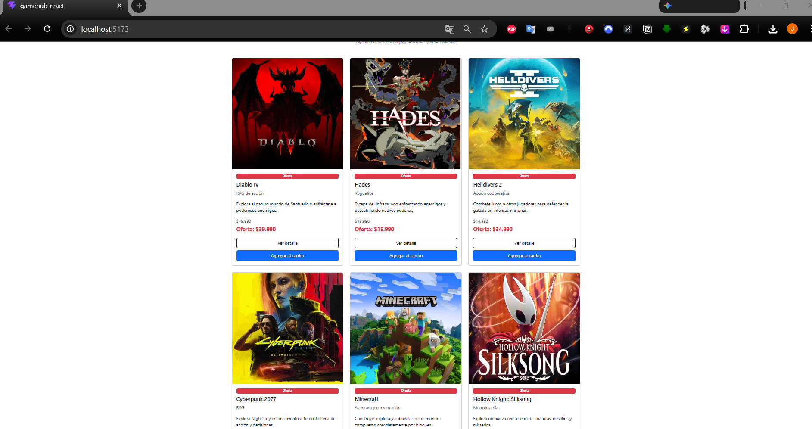
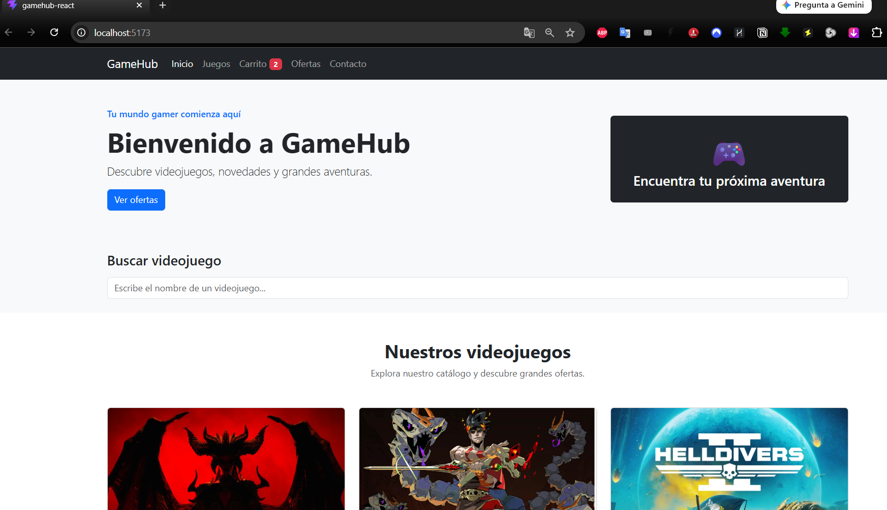
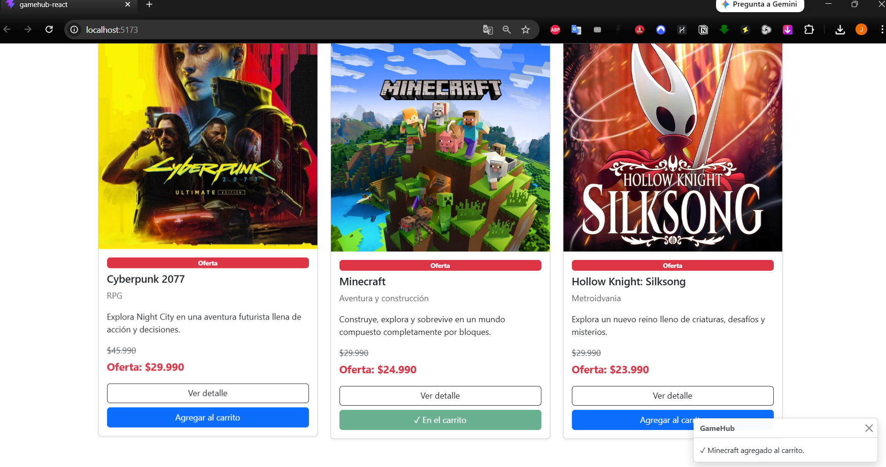
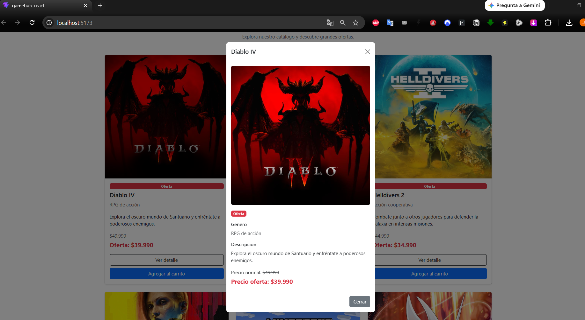
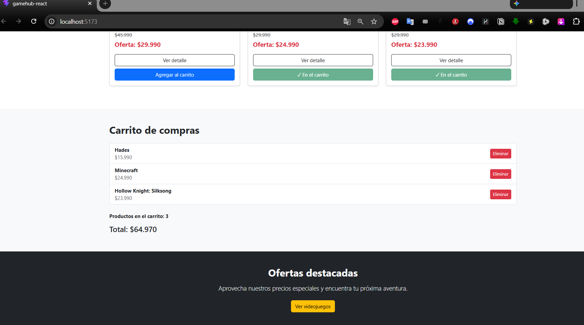
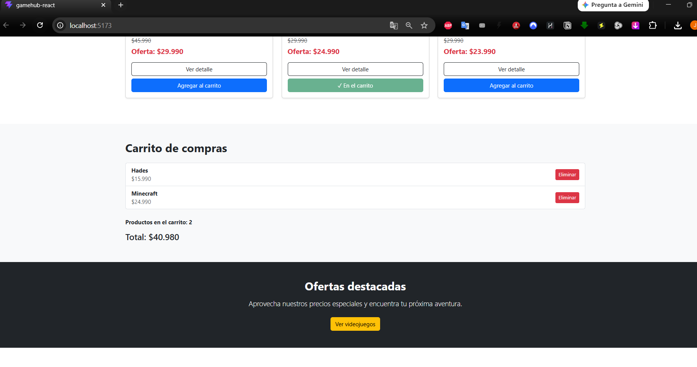
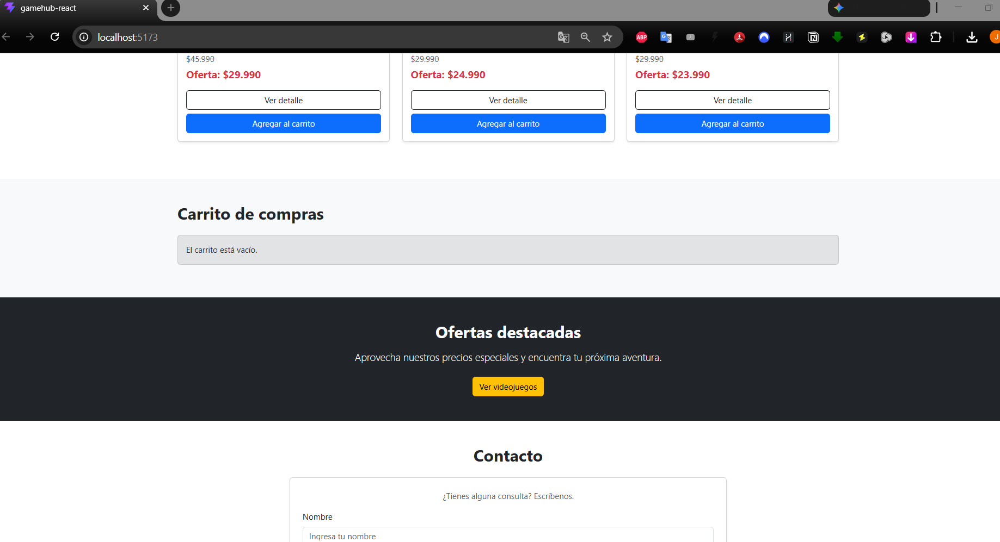
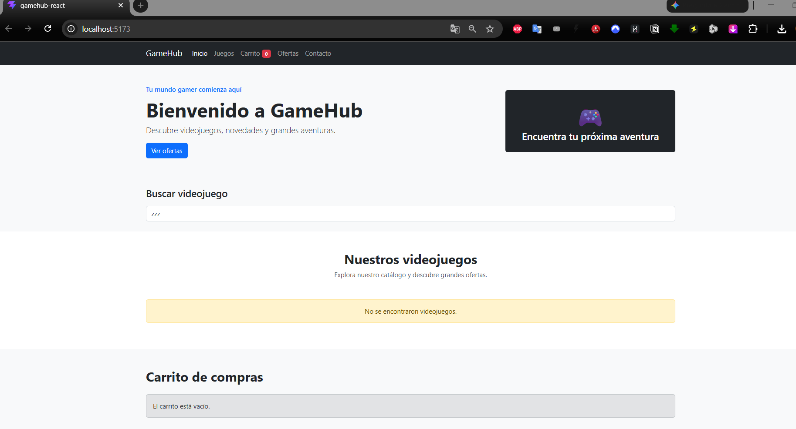
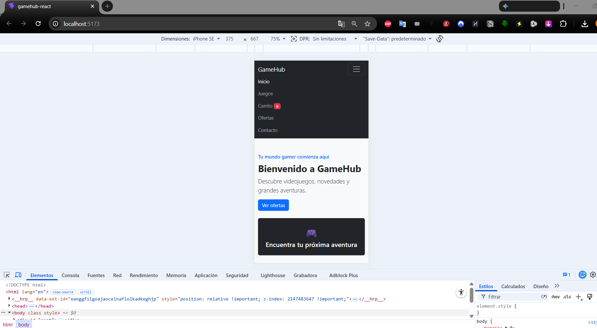

# GameHub - eCommerce de Videojuegos con React

## Descripción

GameHub es una aplicación web de eCommerce desarrollada con React que permite visualizar un catálogo de videojuegos, buscar productos y gestionar un carrito de compras.

El proyecto corresponde a la actividad sumativa de la Semana 8 de la asignatura Desarrollo Frontend I (PFY2201).

Esta versión continúa el proyecto desarrollado durante la Semana 7 e incorpora carga dinámica de productos mediante una API REST, gestión de estados con `useState`, manejo de efectos secundarios con `useEffect`, renderizado condicional y nuevos elementos interactivos.

---

## Tecnologías utilizadas

- React
- Vite
- JavaScript
- JSX
- Bootstrap 5
- CSS
- HTML5
- Node.js
- Express
- API REST
- Fetch API
- Git y GitHub

---

## Funcionalidades

La aplicación incluye las siguientes funcionalidades:

- Carga dinámica del catálogo desde una API REST.
- API REST desarrollada con Express.
- Archivo JSON con los datos de los videojuegos.
- Visualización de videojuegos en tarjetas.
- Nombre del producto.
- Género.
- Descripción.
- Imagen.
- Precio normal.
- Precio de oferta.
- Búsqueda dinámica de videojuegos.
- Agregar productos al carrito.
- Eliminar productos del carrito.
- Contador de productos mediante Badge.
- Cálculo automático del total del carrito.
- Cambio del botón `Agregar al carrito` por `✓ En el carrito`.
- Modal con información detallada del videojuego.
- Toast al agregar un producto al carrito.
- Mensaje cuando el carrito está vacío.
- Mensaje cuando una búsqueda no encuentra resultados.
- Indicador de carga mientras se obtienen los productos.
- Mensaje de error si no se pueden cargar los datos.
- Archivo JSON local como respaldo para GitHub Pages.
- Diseño responsive mediante Bootstrap.

---

## Arquitectura de la aplicación

El catálogo de videojuegos se obtiene dinámicamente desde el backend mediante una API REST.

```text
productos.json
      |
      v
Backend Express
      |
      v
GET /api/productos
      |
      v
fetch()
      |
      v
useEffect()
      |
      v
useState()
      |
      v
Componentes React
```

En desarrollo local, React obtiene los datos desde:

```text
http://localhost:3000/api/productos
```

Si la API REST no se encuentra disponible, la aplicación utiliza un archivo JSON local como respaldo.

---

## Estructura del proyecto

```text
8. Actividad Sumativa/
|
├── backend/
│   ├── data/
│   │   └── productos.json
│   ├── app.js
│   ├── package.json
│   └── package-lock.json
|
├── evidencias/
|
├── public/
│   ├── data/
│   │   └── productos.json
│   └── img/
|
├── src/
│   ├── components/
│   │   ├── CartToast.jsx
│   │   ├── Contact.jsx
│   │   ├── Footer.jsx
│   │   ├── Header.jsx
│   │   ├── Hero.jsx
│   │   ├── Offers.jsx
│   │   ├── ProductCard.jsx
│   │   ├── ProductList.jsx
│   │   ├── ProductModal.jsx
│   │   ├── SearchBar.jsx
│   │   └── ShoppingCart.jsx
│   ├── App.jsx
│   ├── index.css
│   └── main.jsx
|
├── README.md
├── package.json
└── vite.config.js
```

Cada componente posee una responsabilidad específica para mantener el código organizado, reutilizable y fácil de mantener.

---

## Uso de useState

La aplicación utiliza el Hook `useState` para manejar los distintos estados dinámicos.

Entre los estados principales se encuentran:

```javascript
const [juegos, setJuegos] = useState([]);
const [carrito, setCarrito] = useState([]);
const [busqueda, setBusqueda] = useState("");
const [cargando, setCargando] = useState(true);
const [error, setError] = useState(null);
const [juegoSeleccionado, setJuegoSeleccionado] = useState(null);
const [mensajeToast, setMensajeToast] = useState("");
```

Estos estados permiten administrar el catálogo, carrito, búsqueda, carga de datos, errores, modal y notificaciones.

---

## Uso de useEffect

El Hook `useEffect` se utiliza para cargar dinámicamente el catálogo de videojuegos al iniciar la aplicación.

La aplicación realiza una solicitud mediante `fetch()` a la API REST:

```javascript
fetch("http://localhost:3000/api/productos");
```

Los datos recibidos en formato JSON son almacenados en el estado mediante `setJuegos()`.

También se utiliza `useEffect` en el componente del Toast para ocultar automáticamente la notificación después de unos segundos.

---

## API REST

El backend utiliza Node.js y Express para exponer el catálogo de videojuegos.

Endpoint utilizado:

```text
GET /api/productos
```

Dirección local:

```text
http://localhost:3000/api/productos
```

La API obtiene los productos desde:

```text
backend/data/productos.json
```

---

## Renderizado condicional

La aplicación utiliza renderizado condicional para mejorar la experiencia del usuario.

Algunos ejemplos son:

```text
Cargando videojuegos...
```

```text
No fue posible cargar el catálogo de videojuegos.
```

```text
El carrito está vacío.
```

```text
No se encontraron videojuegos.
```

El botón de cada producto también cambia según el estado:

```text
Agregar al carrito
```

se transforma en:

```text
✓ En el carrito
```

cuando el producto ya fue agregado.

---

## Badge

Bootstrap Badge se utiliza para mostrar dinámicamente la cantidad de videojuegos agregados al carrito.

Ejemplo:

```text
Carrito 2
```

Las tarjetas también utilizan un Badge para destacar los productos en oferta.

---

## Modal

Cada videojuego dispone de un botón:

```text
Ver detalle
```

que abre un Modal de Bootstrap con información adicional del producto:

```text
Imagen
Título
Género
Descripción
Precio normal
Precio de oferta
```

El videojuego seleccionado se controla mediante el estado `juegoSeleccionado`.

---

## Toast

Cuando un videojuego es agregado al carrito se muestra una notificación Toast.

Ejemplo:

```text
✓ Hades agregado al carrito.
```

La notificación desaparece automáticamente después de unos segundos y también puede ser cerrada manualmente.

---

## Métodos de JavaScript utilizados

### map()

Permite recorrer el catálogo y generar las tarjetas de videojuegos.

### filter()

Se utiliza para filtrar videojuegos mediante el buscador y para eliminar productos del carrito.

### reduce()

Permite calcular el valor total de los videojuegos agregados al carrito.

### some()

Permite comprobar si un videojuego ya se encuentra en el carrito y modificar el botón de la tarjeta.

---

## Instalación y ejecución

### Backend

Desde la carpeta:

```text
backend/
```

instalar las dependencias:

```bash
npm install
```

Ejecutar el servidor:

```bash
node app.js
```

La API estará disponible en:

```text
http://localhost:3000/api/productos
```

### Frontend

Desde la carpeta principal del proyecto:

```bash
npm install
```

Ejecutar React:

```bash
npm run dev
```

La aplicación estará disponible normalmente en:

```text
http://localhost:5173/
```

---

# Evidencias

## API REST

La API REST retorna dinámicamente el catálogo de videojuegos en formato JSON.



---

## Catálogo con carga dinámica

React obtiene los datos mediante Fetch API y `useEffect`.



---

## Badge del carrito

El contador del carrito se actualiza dinámicamente según los productos agregados.



---

## Botón condicional y Toast

Al agregar un videojuego, el botón cambia a `✓ En el carrito` y se muestra una notificación Toast.



---

## Modal de detalle

El botón `Ver detalle` permite visualizar información adicional del videojuego mediante un Modal.



---

## Carrito de compras

El carrito muestra los productos agregados, cantidad y precio total.



---

## Eliminación de productos

Los videojuegos pueden eliminarse individualmente del carrito.



---

## Carrito vacío

Cuando no existen productos agregados se muestra un mensaje mediante renderizado condicional.



---

## Búsqueda sin resultados

La aplicación informa cuando la búsqueda no encuentra coincidencias.



---

## Diseño responsive

La interfaz se adapta a dispositivos con pantallas de menor tamaño.



---

## Repositorio

El código fuente del proyecto se encuentra disponible en GitHub:

https://github.com/Johanromanque/Desarrollo_Frontend_I

La aplicación será desplegada mediante GitHub Pages:

[PENDIENTE_ACTUALIZAR_GITHUB_PAGES](https://johanromanque.github.io/Desarrollo_Frontend_I/8.%20Actividad%20Sumativa/)

---

## Autor

**Johan Romanque**

Desarrollo Frontend I - PFY2201  
Duoc UC
